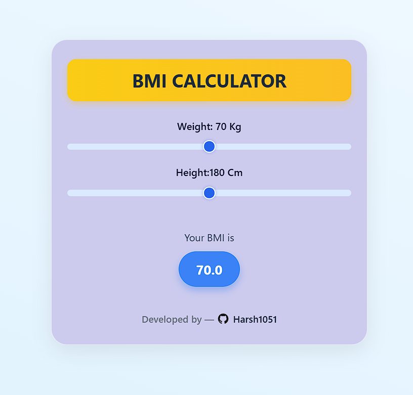

# BMI Calculator React App

This is a simple and visually appealing **Body Mass Index (BMI) Calculator** built using **React** and styled with **custom CSS**.

---

## 🚀 Features

- 🎯 Real-time BMI calculation
- 🎨 Modern card-style UI with smooth gradients and responsiveness
- 📱 Fully responsive design (mobile, tablet, desktop)
- ⚙️ Lightweight and fast (built with Vite)

---

## 📸 Preview

 

---

## 🧮 What is BMI?

**Body Mass Index (BMI)** is a number calculated using your height and weight. It helps estimate whether you are underweight, normal, overweight, or obese.

**Formula:**

BMI = weight(kg) / [height(m)]²


---

## 🛠️ Tech Stack

- [React](https://reactjs.org/)
- HTML, CSS (no Tailwind or Bootstrap)

---

## 🔧 Setup & Run Locally

```bash
# Clone the repository
git clone https://github.com/yourusername/bmi-calculator.git

# Navigate to the project folder
cd bmi-calculator

# Install dependencies
npm install

# Run the development server
npm run dev
